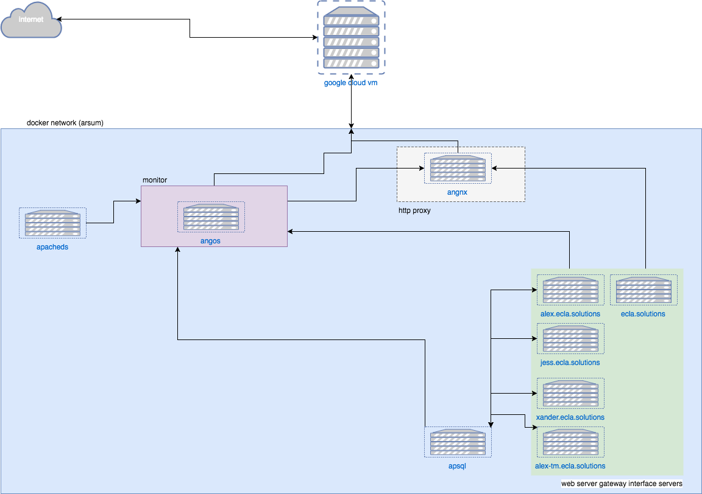

rsum package docs
=================

.. autosummary::
   :toctree: modules

   rsum.settings
   rsum.settings.rsum
   home
   home.schema
   home.schema.cv
   home.models
   home.exam
   home.exam.cv
   home.exam.section
   home.exam.subsection
   home.exam.project
   home.exam.projectitem
   home.exam.entry
   home.exam.entryitem

.. toctree::
   :glob:
   :maxdepth: 2

   modules/rsum.wsgi.rst
   modules/rsum.urls.rst
   modules/home.tests.rst
   modules/home.views.rst

Data Structure
--------------

.. image:: img/data-structure-yml.png

Django Control Flow
-------------------

.. image:: img/flowchart-django.png

Network
-------

.. vim: ft=rst sts=3 sw=3 ts=3:
