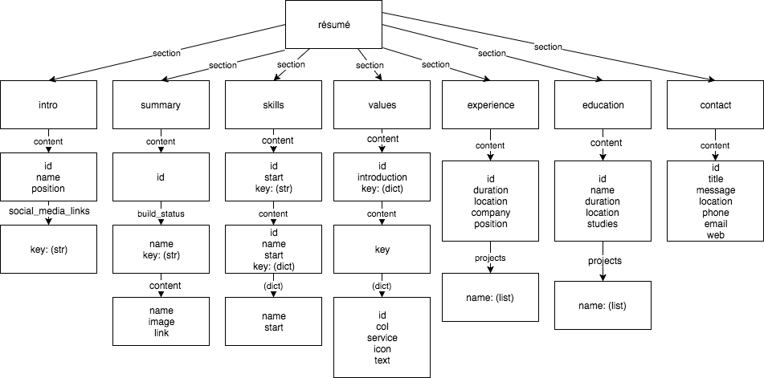
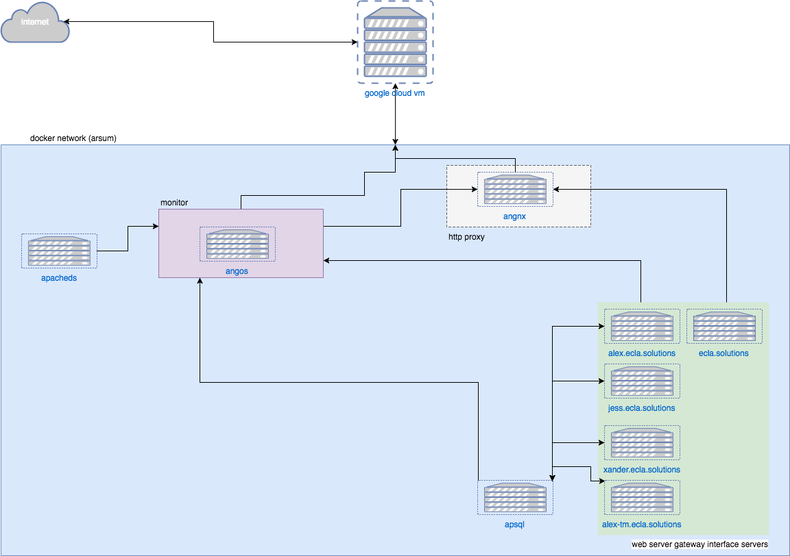

rsum package docs
=================

.. autosummary::
   :toctree: home 

   home

.. autosummary::
   :toctree: rsum

   rsum

Data Structure
==============

Would be nice if this image worked. 

.. .. image:: data-strcuture-yml.png

Schema
======

.. image:: _static/img/schema.png

Django Control Flow
===================

.. image:: _static/img/flowchart-django.png

Network
=======

.. vim: ft=rst sts=3 sw=3 ts=3:
