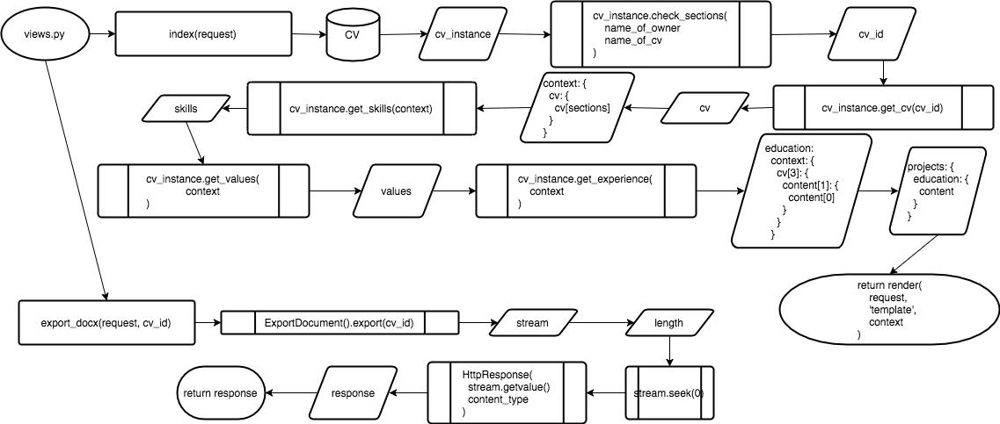

rsum package docs
=================

.. autosummary::
   :toctree: modules

   home
   home.models
   home.tests
   home.views
   rsum
   rsum.settings
   rsum.settings.mrsum

Data Structure
==============

.. image:: _static/img/data-structure-yml.png

.. .. image:: data-strcuture-yml.png

Schema
======

.. image:: img/schema.png

Django Control Flow
===================

Network
=======

.. image:: img/network.png

.. vim: ft=rst sts=3 sw=3 ts=3:
